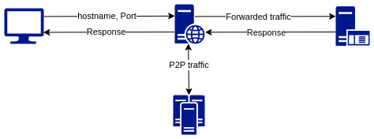
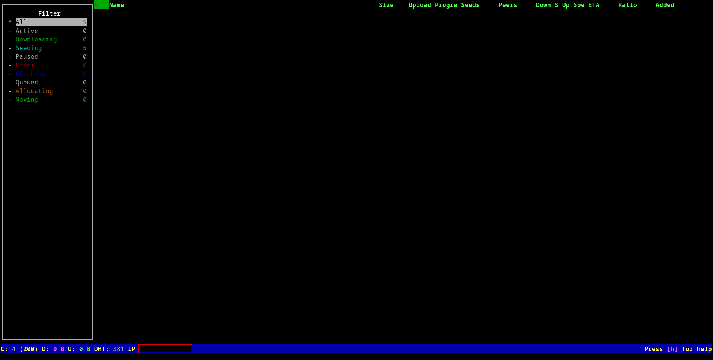

# Guide for setting up a self-hosted VPN-protected seedbox

A seedbox is a dedicated machine used for downloading and seeding torrents. Using a seedbox instead of torrenting on your own device has several advantages
* It doesn't compete for system resources with other software
* It's convenient for torrents where seeders only appear occasionally
* You can seed 24/7, making it easier to get a high ratio or keeping niche torrents alive
* If you torrent regularly, a seedbox might cost you less than the extra electricity cost for keeping your device on

There are different ways to go about creating one, each has their own benefits and limitations. We will only cover the last type of seedbox, since you can find plenty of guides on the first two kinds.


## Types of seedboxes

### Managed seedbox

There are many seedbox providers that host a preconfigured seedbox for you. These usually come with additional utility tools as well as dashboards for tracking your activity. However, **if you plan to use public trackers you might quickly run into trouble**. Some providers explicitely forbid public trackers in their TOS or disable them on a technical level.

### Self-hosted preconfigured seedbox

Such a seedbox needs to be installed and configured on a Virtual Private Server (VPS) by yourself. There are free products (e.g. swizzin) with an easy installation process that come with utility tools and dashboards, just like in the previous option. If you live in a torrent-friendly country and use a torrent-friendly VPS provider this is probably the best option for you.

### Self-hosted VPN-protected seedbox

In addition to installing and configuring the seedbox on a VPS, this type of seedbox also redirects all of it's traffic through a VPN. The advantage is that your VPS (and thus you yourself) won't get into trouble for torrenting activity. In addition you might get a bigger selection of torrent-friendly countries, as VPS locations are usually more limited than VPN locations.

**This is the safest option which allows you to torrent without worrying at all, but it also has the biggest limitations.** First of all you are dependent on port-forwarding through your VPN (more on that later) which makes most bundled seedbox solutions unviable. In addition to that since all of your traffic goes through a VPN, this will be your bottleneck. It might make more sense to host several small seedboxes of this type, instead of one beefy seedbox. These two factors also make it less convenient to stream directly from your seedbox on a personal device.

## Overview the network structure and why it gets complicated

Normally you interact with your VPS using it's URL/hostname and the relevant port for whatever you're doing. This is very straightforward and what most of you already are familiar with.


If you want to route all of the VPS traffic through a VPN this adds a middle layer and several complications
* You no longer interact with the IP of your VPS. Instead you go through the exit IP of the VPN server you're connected to, which is hard to look up and regularly changes
* You need to port-forward through the VPN. Those VPN providers that support port-forwarding have a strict limit on the number of ports you can be assigned
* You need to port-forward on your VPS, either through supported configurations of a software (e.g. sshd_config) or by using a general approach (e.g. via iptables)



## What you need for this setup

### VPN with support for port-forwarding
You need a VPN provider that 
* you personally trust
* supports port-forwarding
* has servers in torrent-friendly countries
* ideally offers good upload/download speeds

A good VPN comparison can be found [here](https://techlore.tech/vpn). Not all of the criteria above are included in the chart.

### VPS provider
You need a VPS provider that
* doesn't prohibit P2P traffic
* offers storage focused products
Since your bottleneck is going to be your upload/download speed forget about renting SSD machines. Go with cheap HDD storage, multiple CPU cores and some decent bandwidth. Interserver and Nexusbytes offer good value for money in this case, though do your own research since these things change quickly.


### DDNS provider or a Domain registrar with DDNS support
Dynamic DNS (DDNS) is a service that regularly checks the external IP of the server it is installed on, and updates DNS records accordingly. Once you connect your VPS to your VPN you will get kicked out of it. If you haven't properly set up DDNS at that point you can start your setup all over again.

If you don't own a domain there are free DDNS service providers. If you already use a Domain registrar, check if they offer a DDNS tool or API.

# Example setup on Ubuntu 20.04 LTS
This is a beginner-friendlyish minimalist setup withou a graphical Torrent client and without any media server. If you succeed setting this up feel free to dabble in how to set up the media server of your choice (fuck Plex, all my homies hate Plex) or a UI for managing torrents in your browser (e.g. rTorrent, Transmission).
1. Create your server
2. Connect to the server using SSH
```bash
   ssh root@<IPv4>
```
3. Run a system update and install a few required packages
```bash
   apt update -y && apt upgrade -y && apt install ncdu deluged deluge-console -y && reboot
```
4. Generate SSH keys. Open your terminal and run 
```bash
   ssh-keygen -t rsa
```
5. Copy your public SSH key to your server
```bash
   ssh-copy-id -i ~/.ssh/id_rsa.pub root@<IPv4>
```
6. Connect to your server
7. Once you're in the server again, reconfigure SSH to make your server more secure
	1. Open /etc/ssh/sshd_config
	2. Set **PermitRootLogin** to **prohibit-password**
	3. Set **PasswordAuthentication** to **no**
	4. Save your changes and reboot the server or restart the SSH service 
8. Connect to your server. If you are locked out at this point, start over
9. Set up your DDNS script/tool. If it does not automatically refresh your DNS records you will have to configure a regular run using crontab. You do not have to restart any service or reboot the server for this change to be applied. If you plan to run multiple seedboxes it is ideal to assign a subdomain to each seedbox
	1. Open /etc/crontab
	2. To refresh every 5 minutes add the line 
	```bash
	   0,5,15,20,25,30,35,40,45,50,55 * * * * root <Your_Command>
	```
10. Check if your DNS records have been updated. If so, try connecting to the server using your domain
```bash
   ssh root@<subdomain>.<domain>
```
11. Request a port to be forwarded through your VPN provider. Go into /etc/ssh/sshd_config and make sure to uncomment the line **Port 22** and change the number to the port you were assigned. Afterwards, reboot or restart the ssh service
12. Try connecting to your server using your domain as well as the custom port
```bash
   ssh root@<subdomain>.<domain> -p <Custom_Port>
```
13. Install and connect to your VPN. Close your frozen terminal and open a new one
14. Wait until the next 5 minute mark (and maybe give it an extra minute), then try connecting the same way you did in step 12. If this works, congrats, you completed the hard part
15. For our minimalist torrenting setup we use the CLI based tool deluge-console. First we need to tweak the daemon a bit. Official instructions can be found [here](https://dev.deluge-torrent.org/wiki/UserGuide/ThinClient)
	1. Disable the deluge daemon. That way your torrenting will not automatically resume if your VPS happens to reboot without your knowledge, and without auto-connecting to your VPN
	```bash
	   systemctl disable deluged
	```
	2. Check if the service is active, otherwise start it
	```bash
	   systemctl status deluged
	   systemctl start deluged
	```
	3. Start an instance of it (for some reason it's not enough for the service to be active)
	```bash
	   deluged
	```
	4. Open the CLI by running
	```bash
	   deluge-console
	```
	5. Make sure the IP on the bottom is **NOT** the same as that of your VPS

 That's it. Have fun torrenting and don't forget to maintain a ratio of >2. If you need to use torrent files instead of magnet links you can upload them using sftp, using the same custom port as for SSH. To download files from the server to your device, use sftp as well.
 
 If you want to continue installing more utils, keep in mind that you will need to request an additional port from your VPN provider for each service you use. For internal port forwarding from port X to port Y, which your application listens to, you can use
```bash
   iptables -t nat -A PREROUTING -i eth0 -p tcp -m tcp --dport <X> -j REDIRECT --to-ports <Y>
```
To list internal port forwarding rules use 
```bash
   iptables -t nat --list
```


# Common issues

## DDNS tool/script doesn't work

Possible causes are
* Issues determining the external IP
	* Solution: Check if you can pass an IP address manually. Some tools allow for an argument using the **-i** flag. There are [several](https://linuxnightly.com/check-external-ip-from-linux-command-line/) ways to check for it manually, one simple way would be 
```bash
  -i $(wget -4 -qO - icanhazip.com)
```
* Issues connecting to the DDNS provider
	* Solution: Your DDNS provider could be blocking incoming traffic from the datacenter that is used by your VPS provider. To check that curl the address that your DDNS tool uses on your server and your personal device and compare the results. If your DDNS provider indeed blocks that datacenter, ask them if they can whitelist your IP

## Unknown address

If you try to connect to your VPS using the hostname that is updated with your DDNS tool, you might get an error that the address is unknown.

Solution: Check if your DNS records have been updated. If they were not, you have not properly set up your DDNS. If they are, you might have to wait a bit until the Time To Live (TTL) that comes with each record change.
